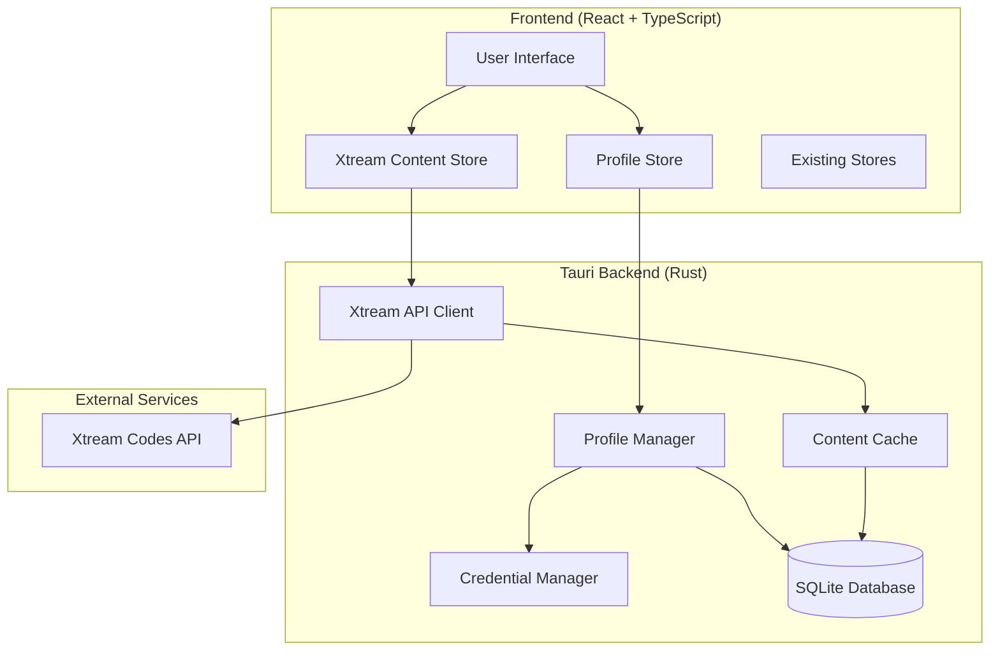

# Design Document

## Overview

This design document outlines the integration of Xtream Codes API functionality into the existing Tauri-based IPTV application. The solution will replace the current playlist-based approach with a profile-based system that supports multiple Xtream Codes providers simultaneously. The architecture leverages the existing Zustand state management, Tauri backend, and SQLite database while adding new components for Xtream API integration, profile management, and secure credential storage.

## Architecture

### High-Level Architecture



### Data Flow

1. **Profile Management**: Users create/edit profiles through the UI, which are validated and stored securely
2. **Authentication**: Profile selection triggers authentication with the corresponding Xtream server
3. **Content Fetching**: Authenticated sessions enable fetching of channels, VOD, series, and EPG data
4. **Caching**: Content is cached locally to improve performance and reduce API calls
5. **Playback**: Selected content generates streaming URLs for the existing video player

## Components and Interfaces

### Frontend Components

#### Profile Management Store
```typescript
interface ProfileState {
  profiles: XtreamProfile[];
  activeProfile: XtreamProfile | null;
  isAuthenticating: boolean;
  authError: string | null;
  
  // Actions
  createProfile: (profile: CreateProfileRequest) => Promise<void>;
  updateProfile: (id: string, profile: UpdateProfileRequest) => Promise<void>;
  deleteProfile: (id: string) => Promise<void>;
  setActiveProfile: (id: string) => Promise<void>;
  validateProfile: (profile: ProfileCredentials) => Promise<boolean>;
}
```

#### Xtream Content Store
```typescript
interface XtreamContentState {
  // Content data
  channels: XtreamChannel[];
  channelCategories: XtreamCategory[];
  movies: XtreamMoviesListing[];
  movieCategories: XtreamCategory[];
  series: XtreamShowListing[];
  seriesCategories: XtreamCategory[];
  
  // Loading states
  isLoadingChannels: boolean;
  isLoadingMovies: boolean;
  isLoadingSeries: boolean;
  
  // Actions
  fetchChannelCategories: () => Promise<void>;
  fetchChannels: (categoryId?: string) => Promise<void>;
  fetchMovieCategories: () => Promise<void>;
  fetchMovies: (categoryId?: string) => Promise<void>;
  fetchSeriesCategories: () => Promise<void>;
  fetchSeries: (categoryId?: string) => Promise<void>;
  fetchMovieDetails: (movieId: string) => Promise<XtreamMovie>;
  fetchSeriesDetails: (seriesId: string) => Promise<XtreamShow>;
  fetchEPG: (channelId: string) => Promise<XtreamShortEPG>;
}
```

#### UI Components
- **ProfileManager**: Component for creating, editing, and managing profiles
- **ProfileSelector**: Dropdown/list for selecting active profile
- **ContentBrowser**: Enhanced version of existing content browser with Xtream content types
- **XtreamChannelList**: Specialized channel list for Xtream channels
- **XtreamMovieGrid**: Grid layout for VOD content
- **XtreamSeriesBrowser**: Series browser with season/episode navigation

### Backend Components

#### Profile Manager (Rust)
```rust
pub struct ProfileManager {
    db: Arc<Database>,
    credential_manager: Arc<CredentialManager>,
}

impl ProfileManager {
    pub async fn create_profile(&self, profile: CreateProfileRequest) -> Result<String>;
    pub async fn update_profile(&self, id: &str, profile: UpdateProfileRequest) -> Result<()>;
    pub async fn delete_profile(&self, id: &str) -> Result<()>;
    pub async fn get_profiles(&self) -> Result<Vec<XtreamProfile>>;
    pub async fn get_profile(&self, id: &str) -> Result<Option<XtreamProfile>>;
    pub async fn validate_credentials(&self, credentials: &ProfileCredentials) -> Result<bool>;
}
```

#### Xtream API Client (Rust)
```rust
pub struct XtreamClient {
    client: reqwest::Client,
    base_url: String,
    credentials: ProfileCredentials,
    cache: Arc<ContentCache>,
}

impl XtreamClient {
    pub async fn authenticate(&mut self) -> Result<XtreamProfile>;
    pub async fn get_channel_categories(&self) -> Result<Vec<XtreamCategory>>;
    pub async fn get_channels(&self, category_id: Option<&str>) -> Result<Vec<XtreamChannel>>;
    pub async fn get_movie_categories(&self) -> Result<Vec<XtreamCategory>>;
    pub async fn get_movies(&self, category_id: Option<&str>) -> Result<Vec<XtreamMoviesListing>>;
    pub async fn get_movie_info(&self, movie_id: &str) -> Result<XtreamMovie>;
    pub async fn get_series_categories(&self) -> Result<Vec<XtreamCategory>>;
    pub async fn get_series(&self, category_id: Option<&str>) -> Result<Vec<XtreamShowListing>>;
    pub async fn get_series_info(&self, series_id: &str) -> Result<XtreamShow>;
    pub async fn get_short_epg(&self, channel_id: &str) -> Result<XtreamShortEPG>;
    pub async fn generate_stream_url(&self, request: StreamURLRequest) -> Result<String>;
}
```

#### Credential Manager (Rust)
```rust
pub struct CredentialManager {
    encryption_key: [u8; 32],
}

impl CredentialManager {
    pub fn new() -> Result<Self>;
    pub fn encrypt_credentials(&self, credentials: &ProfileCredentials) -> Result<Vec<u8>>;
    pub fn decrypt_credentials(&self, encrypted: &[u8]) -> Result<ProfileCredentials>;
    pub fn store_credentials(&self, profile_id: &str, credentials: &ProfileCredentials) -> Result<()>;
    pub fn retrieve_credentials(&self, profile_id: &str) -> Result<Option<ProfileCredentials>>;
    pub fn delete_credentials(&self, profile_id: &str) -> Result<()>;
}
```

#### Content Cache (Rust)
```rust
pub struct ContentCache {
    db: Arc<Database>,
    memory_cache: Arc<DashMap<String, CachedContent>>,
    cache_duration: Duration,
}

impl ContentCache {
    pub async fn get<T>(&self, key: &str) -> Result<Option<T>> where T: DeserializeOwned;
    pub async fn set<T>(&self, key: &str, value: &T, ttl: Option<Duration>) -> Result<()> where T: Serialize;
    pub async fn invalidate(&self, pattern: &str) -> Result<()>;
    pub async fn clear_profile_cache(&self, profile_id: &str) -> Result<()>;
}
```

## Data Models

### Profile Models
```typescript
interface XtreamProfile {
  id: string;
  name: string;
  url: string;
  username: string;
  // password is stored encrypted and not exposed in this interface
  created_at: string;
  updated_at: string;
  last_used: string | null;
  is_active: boolean;
}

interface CreateProfileRequest {
  name: string;
  url: string;
  username: string;
  password: string;
}

interface UpdateProfileRequest {
  name?: string;
  url?: string;
  username?: string;
  password?: string;
}

interface ProfileCredentials {
  url: string;
  username: string;
  password: string;
}
```

### Content Models
The existing Xtream types from `src/types/types.ts` will be reused with minimal modifications:
- `XtreamChannel` - Enhanced with generated stream URLs
- `XtreamMoviesListing` & `XtreamMovie` - For VOD content
- `XtreamShowListing` & `XtreamShow` - For series content
- `XtreamCategory` - For content categorization
- `XtreamShortEPG` & `XtreamFullEPG` - For program guide data

### Database Schema
```sql
-- Profiles table
CREATE TABLE xtream_profiles (
    id TEXT PRIMARY KEY,
    name TEXT NOT NULL UNIQUE,
    url TEXT NOT NULL,
    username TEXT NOT NULL,
    encrypted_credentials BLOB NOT NULL,
    created_at DATETIME DEFAULT CURRENT_TIMESTAMP,
    updated_at DATETIME DEFAULT CURRENT_TIMESTAMP,
    last_used DATETIME,
    is_active BOOLEAN DEFAULT FALSE
);

-- Content cache table
CREATE TABLE xtream_content_cache (
    cache_key TEXT PRIMARY KEY,
    profile_id TEXT NOT NULL,
    content_type TEXT NOT NULL,
    data BLOB NOT NULL,
    expires_at DATETIME NOT NULL,
    created_at DATETIME DEFAULT CURRENT_TIMESTAMP,
    FOREIGN KEY (profile_id) REFERENCES xtream_profiles(id) ON DELETE CASCADE
);

-- Profile-specific favorites
CREATE TABLE xtream_favorites (
    id TEXT PRIMARY KEY,
    profile_id TEXT NOT NULL,
    content_type TEXT NOT NULL, -- 'channel', 'movie', 'series'
    content_id TEXT NOT NULL,
    content_data BLOB NOT NULL,
    created_at DATETIME DEFAULT CURRENT_TIMESTAMP,
    FOREIGN KEY (profile_id) REFERENCES xtream_profiles(id) ON DELETE CASCADE,
    UNIQUE(profile_id, content_type, content_id)
);

-- Profile-specific viewing history
CREATE TABLE xtream_history (
    id TEXT PRIMARY KEY,
    profile_id TEXT NOT NULL,
    content_type TEXT NOT NULL,
    content_id TEXT NOT NULL,
    content_data BLOB NOT NULL,
    watched_at DATETIME DEFAULT CURRENT_TIMESTAMP,
    FOREIGN KEY (profile_id) REFERENCES xtream_profiles(id) ON DELETE CASCADE
);
```

## Error Handling

### Error Types
```rust
#[derive(Debug, thiserror::Error)]
pub enum XtreamError {
    #[error("Authentication failed: {0}")]
    AuthenticationFailed(String),
    
    #[error("Network error: {0}")]
    NetworkError(#[from] reqwest::Error),
    
    #[error("Invalid credentials")]
    InvalidCredentials,
    
    #[error("Profile not found: {0}")]
    ProfileNotFound(String),
    
    #[error("API error: {status} - {message}")]
    ApiError { status: u16, message: String },
    
    #[error("Cache error: {0}")]
    CacheError(String),
    
    #[error("Encryption error: {0}")]
    EncryptionError(String),
    
    #[error("Database error: {0}")]
    DatabaseError(#[from] rusqlite::Error),
}
```

### Error Recovery Strategies
1. **Network Errors**: Implement exponential backoff with retry logic
2. **Authentication Failures**: Clear cached credentials and prompt for re-authentication
3. **API Errors**: Graceful degradation with cached content when available
4. **Timeout Handling**: Configurable timeouts with user feedback
5. **Malformed Responses**: Robust parsing with fallback to default values

## Testing Strategy

### Unit Tests
- **Profile Management**: Test CRUD operations, validation, and encryption
- **Xtream Client**: Mock API responses and test parsing logic
- **Content Cache**: Test cache hit/miss scenarios and expiration
- **Credential Manager**: Test encryption/decryption and secure storage

### Integration Tests
- **End-to-End Profile Workflow**: Create profile → authenticate → fetch content
- **API Integration**: Test against real Xtream servers (with test accounts)
- **Database Operations**: Test concurrent access and data integrity
- **Error Scenarios**: Test network failures, invalid responses, and recovery

### Performance Tests
- **Content Loading**: Measure time to load large channel lists
- **Cache Performance**: Test cache hit rates and memory usage
- **Concurrent Operations**: Test multiple profile operations simultaneously
- **Memory Usage**: Monitor memory consumption during extended use

### Security Tests
- **Credential Security**: Verify encryption and secure storage
- **API Security**: Test against injection attacks and malformed requests
- **Data Validation**: Test input sanitization and validation
- **Access Control**: Verify profile isolation and data separation

## Migration Strategy

### Phase 1: Core Infrastructure
1. Implement profile management backend
2. Add credential encryption and storage
3. Create basic Xtream API client
4. Set up database schema and migrations

### Phase 2: Content Integration
1. Implement content fetching for channels, movies, and series
2. Add caching layer for performance
3. Create frontend stores and components
4. Integrate with existing video player

### Phase 3: Feature Completion
1. Add EPG support and program guide
2. Implement search and filtering
3. Add profile-specific favorites and history
4. Complete error handling and recovery

### Phase 4: Polish and Optimization
1. Performance optimization and caching improvements
2. Enhanced UI/UX for profile management
3. Advanced features (timeshift, catch-up TV)
4. Comprehensive testing and bug fixes

## Security Considerations

### Credential Protection
- Use platform-specific secure storage (Windows Credential Manager, macOS Keychain, Linux Secret Service)
- Implement AES-256 encryption for stored credentials
- Never log or expose credentials in plain text
- Use secure memory allocation for sensitive data

### API Security
- Validate all API responses and sanitize data
- Implement request rate limiting to prevent abuse
- Use HTTPS for all API communications
- Validate SSL certificates and implement certificate pinning

### Data Isolation
- Ensure complete separation of data between profiles
- Implement proper access controls in database queries
- Clear sensitive data from memory after use
- Secure deletion of profile data when profiles are removed

## Performance Optimization

### Caching Strategy
- **Memory Cache**: Hot data (current profile content) in memory
- **Disk Cache**: Larger datasets with configurable TTL
- **Intelligent Prefetching**: Preload likely-to-be-accessed content
- **Cache Invalidation**: Smart invalidation based on content updates

### Network Optimization
- **Connection Pooling**: Reuse HTTP connections for API calls
- **Compression**: Support gzip/deflate for API responses
- **Parallel Requests**: Fetch multiple content types simultaneously
- **Request Deduplication**: Avoid duplicate API calls

### Database Optimization
- **Indexing**: Proper indexes on frequently queried columns
- **Connection Pooling**: Efficient database connection management
- **Batch Operations**: Group related database operations
- **Query Optimization**: Efficient SQL queries with proper joins