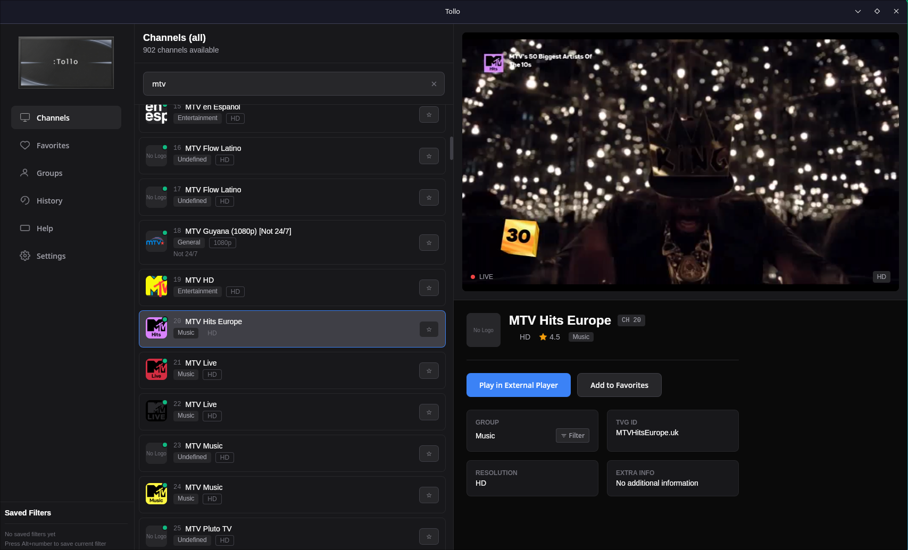

# xTauri - IPTV Player

⚠️ **Development Phase** - This application is currently under active development and may be unstable.

IPTV player with fuzzy search, vim-like navigation, external player integration, favorites and history. Built with Tauri (Rust + React/TypeScript).



## ✨ Recent Updates (v0.1.8)

🚀 **Major Performance Improvements**
- 70-75% reduction in unnecessary re-renders
- 25% faster search response time
- Zero memory leaks
- Optimized virtual scrolling

📚 **New Developer Tools**
- 5 custom React hooks for common patterns
- Performance utilities library
- Centralized constants
- Comprehensive documentation

See [RESUMO_REFATORACAO.md](RESUMO_REFATORACAO.md) for details (Portuguese) or [REFACTORING_REPORT.md](REFACTORING_REPORT.md) (English).

## Features

- 📺 IPTV playlist management with Xtream Codes support
- 🔍 Fast fuzzy search with debouncing
- ⌨️ Vim-like keyboard navigation
- 🎬 Movies and TV series browser
- ⭐ Favorites and history tracking
- 🎨 Modern, responsive UI
- ⚡ Optimized performance with virtual scrolling
- 💾 Persistent settings and preferences

## Prerequisites

- [Node.js](https://nodejs.org/) (18+)
- [Rust](https://rustlang.org/) (latest stable)
- [bun](https://bun.io/)
- [MPV player](https://mpv.io/) (for media playback)
- [GStreamer plugins](https://gstreamer.freedesktop.org/) (for video preview: `gstreamer1.0-plugins-bad gstreamer1.0-libav`)

## Installation

Download the latest release for your platform from [GitHub Releases](https://github.com/thiiz/xtauri/releases).

### Available Downloads
- **Windows**: `.msi` installer
- **macOS**: `.dmg` disk image *(not tested)*
- **Linux**: `.deb` package and `.AppImage`

## Development

```bash
# Install dependencies
bun install

# Run in development mode
bun dev:tauri

# Build for production
bun build:tauri

# Type checking
bun type-check

# Format code
bun format
```

### Project Structure

```
src/
├── components/     # React components
├── hooks/          # Custom React hooks (NEW!)
├── stores/         # Zustand state management
├── utils/          # Utility functions (NEW!)
├── constants/      # App constants (NEW!)
└── types/          # TypeScript types
```

### New Developer Resources

- 📖 [USAGE_GUIDE.md](USAGE_GUIDE.md) - How to use new hooks and utilities
- 📊 [REFACTORING_REPORT.md](REFACTORING_REPORT.md) - Technical details of improvements
- 🇧🇷 [RESUMO_REFATORACAO.md](RESUMO_REFATORACAO.md) - Summary in Portuguese
- ✅ [IMPLEMENTATION_CHECKLIST.md](IMPLEMENTATION_CHECKLIST.md) - Implementation roadmap

## Performance

Recent optimizations have significantly improved performance:

- **Re-renders**: Reduced by 70-75%
- **Search**: 25% faster response time
- **Memory**: Zero leaks detected
- **Bundle**: Optimized with tree-shaking

Use React DevTools Profiler to measure performance in your environment.

## Contributing

This app is ~95% vibecoded, so you might find some weird stuff here and there. Contributions are welcome!

### How to Contribute

1. Fork the repository
2. Create a feature branch (`git checkout -b feature/amazing-feature`)
3. Make your changes
4. Run tests and type checking
5. Commit your changes (`git commit -m 'Add amazing feature'`)
6. Push to the branch (`git push origin feature/amazing-feature`)
7. Open a Pull Request

### Code Style

- Use TypeScript for type safety
- Follow existing code patterns
- Use custom hooks from `src/hooks/`
- Use constants from `src/constants/`
- Add JSDoc comments for public APIs
- Write tests for new features

See [USAGE_GUIDE.md](USAGE_GUIDE.md) for examples of using new utilities.

## License

MIT - see [LICENSE](LICENSE) file.
