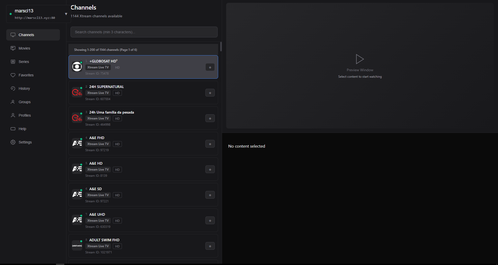

# Tollo - IPTV Player

⚠️ **Development Phase** - This application is currently under active development and may be unstable.

IPTV player with fuzzy search, vim-like navigation, external player integration, favorites and history. Built with Tauri (Rust + React/TypeScript).



## Features

- IPTV playlist management
- Fast fuzzy search
- Vim-like keyboard navigation
- External player integration (MPV)
- Favorites and history

## Prerequisites

- [Node.js](https://nodejs.org/) (18+)
- [Rust](https://rustlang.org/) (latest stable)
- [pnpm](https://pnpm.io/)
- [MPV player](https://mpv.io/) (for media playback)
- [GStreamer plugins](https://gstreamer.freedesktop.org/) (for video preview: `gstreamer1.0-plugins-bad gstreamer1.0-libav`)

## Installation

Download the latest release for your platform from [GitHub Releases](https://github.com/sambergo/tollo/releases).

### Available Downloads
- **Windows**: `.msi` installer
- **macOS**: `.dmg` disk image *(not tested)*
- **Linux**: `.deb` package and `.AppImage`

## Development

```bash
pnpm install
pnpm dev:tauri
```

## Contributing

This app is ~95% vibecoded, so you might find some weird stuff here and there. Contributions are welcome! Feel free to open issues or submit pull requests.

## License

MIT - see [LICENSE](LICENSE) file.
